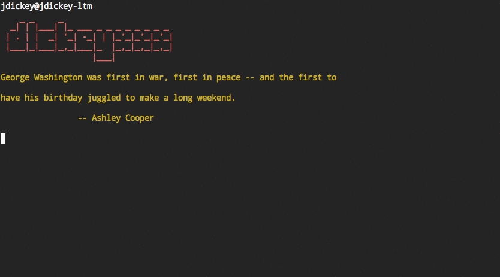

gh
==

gh allows you to very quickly navigate between GitHub project cloned on your
local box. It will `cd` into project directories quickly and clone repos that do
not exist.

There is a lot of mental overhead trying to manage a custom `~/src` directory with your projects. I tried managing by work/personal, programming language, even tried a different directory for each month. I found by simply making your projects path reflect GitHub, it was much easier to remember where things were.

Here is a demo of me moving around various projects



<!-- toc -->

- [Usage](#usage)
  * [Changing the base directory](#changing-the-base-directory)
- [Supported Shells](#supported-shells)
- [Installation for bash](#installation-for-bash)
- [Installation For Fish](#installation-for-fish)
- [Installation For Oh-My-ZSH](#installation-for-oh-my-zsh)
- [Installation for zsh](#installation-for-zsh)
- [GitHub Alternatives](#github-alternatives)
- [Go developers](#go-developers)

<!-- tocstop -->

Usage
=====

Clone and/or go to `~/src/github.com/githubuser/githubrepo`.

```
gh githubuser githubrepo
```

It'll either just be a `cd` or it will clone `git@github.com:githubuser/githubrepo.git`

Note that tab completion is available for project and usernames.

## Changing the base directory
`gh` will clone or `cd` into `$GH_BASE_DIR/github.com/user/repo`.
By default `$GH_BASE_DIR` points to `$HOME/src`. By changing the `$GH_BASE_DIR` variable in your shell's config file, you can control where `gh` will clone/`cd` into.

**Note:** Already cloned repos will not be transferred to the new location, they will be cloned again.

**More important Note:** Do not use the tilde-character (`~`) in `$GH_BASE_DIR`, use `$HOME` instead.

Supported Shells
================

* bash
* [fish](http://fishshell.com/)
* [OH-MY-ZSH](http://ohmyz.sh/)
* zsh

Installation for bash
=====================

```
echo 'source ~/src/github.com/jdxcode/gh/bash/gh.bash' >> ~/.bashrc
echo 'source ~/src/github.com/jdxcode/gh/completions/gh.bash' >> ~/.bashrc
```

Installation For Fish
=====================

Using [oh-my-fish](https://github.com/oh-my-fish/oh-my-fish):

```
omf install gh
```

Using [fisherman](https://github.com/fisherman/fisherman):

```
fisher jdxcode/gh
```

Alternatively, symlink (or copy) the function and completion files into `$fish_function_path` and `$fish_complete_path`

    mkdir -p ~/src/github.com/jdxcode
    git clone git@github.com:jdxcode/gh.git ~/src/github.com/jdxcode/gh
    ln -s ~/src/github.com/jdxcode/gh/functions/gh.fish ~/.config/fish/functions/gh.fish
    ln -s ~/src/github.com/jdxcode/gh/completions/gh.fish ~/.config/fish/completions/gh.fish

Installation For Oh-My-ZSH
==========================

Add this environment variable for your GitHub username (optional)

    typeset +gx -A GITHUB
    GITHUB[user]=jdxcode

Then symlink (or copy) the gh folder into your Oh-My-ZSH plugins folder

    ln -s ~/src/github.com/jdxcode/gh/zsh/gh ~/.oh-my-zsh/custom/plugins/gh

Next add the plugin to your `~/.zshrc` file

    plugins=(gh)

For example:

```
# Which plugins would you like to load? (plugins can be found in ~/.oh-my-zsh/plugins/*)
# Custom plugins may be added to ~/.oh-my-zsh/custom/plugins/
# Example format: plugins=(rails git textmate ruby lighthouse)
plugins=(git brew meteor node npm osx redis-cli sublime gh)

```

Finally reload the `~/.zshrc` file:

    source ~/.zshrc

The zsh autocompletion supports loading a user's repositories from github. For that to work, you need to set the environment variable `GH_FETCH_REPOS` to true. You will also need to install [jsawk](https://github.com/micha/jsawk) for it to work.

If you now type `gh someusername` and then press `<Tab>`, it will load that user's repositories from github and display them to you.

Note that, if autocompletion isn't working, then you probably need to make zsh refresh the completions dumpfile. Just remove the `$HOME/.zcompdump-*` file:

    rm $HOME/.zcompdump-*

and reload the `~/.zshrc` again to regenerate it.

For the `bb` (bitbucket) equivalent, repeat the above instructions, but substitute `gh` with `bb`, i.e.:

    ln -s ~/src/github.com/jdxcode/gh/zsh/bb ~/.oh-my-zsh/custom/plugins/bb
    plugins=(gh bb)
    source ~/.zshrc

As before for `GITHUB` environment variable, the environment variable `BITBUCKET` is optional:

    typeset +gx -A BITBUCKET
    BITBUCKET[user]=jdxcode


Installation for zsh
==========================
Zsh supports bash autocomplete. You can add the following to your .zshrc but make sure you have `compinit` done first.
```
compinit
...
# bash completion and gh
autoload bashcompinit
bashcompinit
source ~/src/github.com/jdxcode/gh/bash/gh.bash
source ~/src/github.com/jdxcode/gh/completions/gh.bash
```

GitHub Alternatives
===================

* bb - bitbucket (fish)
* gl - gitlab (fish, bash)

Go developers
=============

This follows the standard convention for Go projects so long as you have your `GOPATH` set to `~`.
